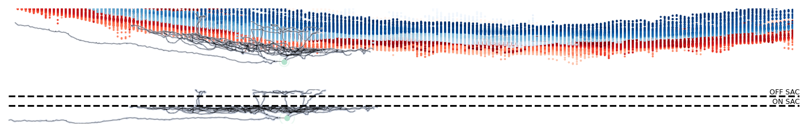

# pywarper

[](https://badge.fury.io/py/pywarper)

`pywarper` is a Python package for conformal mapping-based warping of retinal morphologies, based on the [MATLAB implementations](https://github.com/uygarsumbul/rgc) (Sümbül, et al. 2014). 




## Installation

To install the latest tagged version:

```bash
pip install pywarper
```

Or to install the development version, clone the repository and install it with `pip install -e`:

```bash
git clone https://github.com/berenslab/pywarper.git
pip install -e pywarper
```

## Usage

See [example notebooks](https://github.com/berenslab/pywarper/blob/main/notebooks/) for usage. 